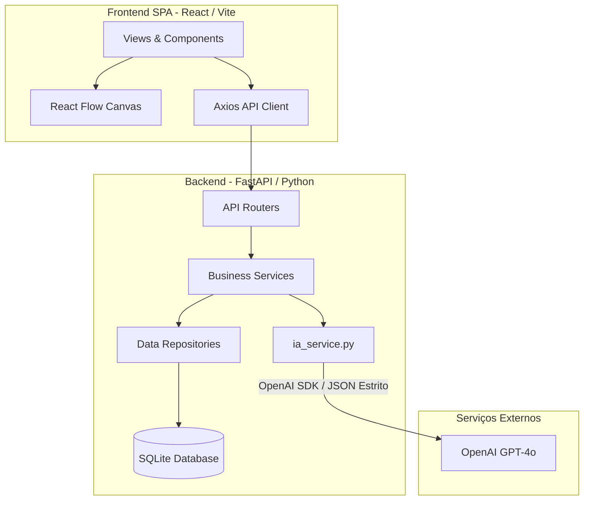
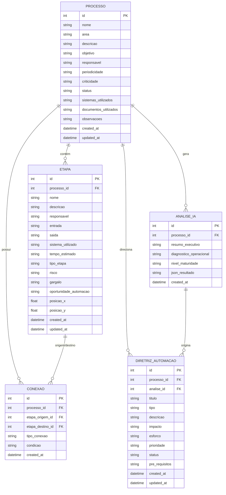

# Resumo Técnico Avançado do MVP — QDT Processos Contábeis

Este documento apresenta uma radiografia técnica e arquitetural detalhada do estado atual (v0.7.0) do sistema **QDT Processos Contábeis - MVP**. O objetivo é servir como especificação técnica de entrada e base de conhecimento completa para um **Agente de Desenvolvimento baseado em SDD (Spec-Driven Development)**, permitindo que ele analise a plataforma, questione sobre melhorias e formule o PRD.md e o TASKS.md para a próxima iteração.

---

## 1. Visão Geral do Sistema

O **QDT Processos Contábeis** é uma plataforma voltada para gestores de operações contábeis. Ela permite:
1. **Modelar e mapear graficamente** fluxos de processos operacionais de contabilidade (etapa por etapa).
2. **Catalogar atributos de negócios** detalhados para cada etapa (sistemas, entradas, saídas, tempo, riscos e gargalos).
3. **Analisar fluxos com Inteligência Artificial** (OpenAI `gpt-4o`) para obter diagnósticos de conformidade, nível de maturidade do processo, pontos fortes, gargalos ocultos, oportunidades de IA e riscos.
4. **Gerar Diretrizes de Automação personalizadas** (RPA, APIs, workflows, IA) de forma estruturada, com a capacidade de gerenciar o status de implementação de cada diretriz de forma isolada em um quadro operacional.

O sistema é desenhado como um **Monorepo** focado em deploys simplificados em nuvem (Railway) e fácil execução local, agrupando um Backend FastAPI (Python) e um Frontend SPA React (Vite).

---

## 2. Arquitetura Geral da Aplicação

O projeto adota uma arquitetura híbrida de desenvolvimento monorepo que facilita a conteinerização unificada:



### Características Arquiteturais Chave:
- **Frontend SPA**: Desenvolvido em React + Vite. Ele monta um canvas interativo via **React Flow** para arrastar, conectar e editar posições $X/Y$ das etapas de processos.
- **Backend API**: FastAPI estruturado em camadas (Routers, Services, Repositories, Models, Database e Schemas).
- **Integração de IA (Structured Outputs)**: O backend se comunica com a OpenAI utilizando um esquema JSON estrito (`response_format={"type": "json_object"}`). As saídas são validadas através de modelos do **Pydantic** antes de serem persistidas.
- **Distribuição em Container Único**: O backend FastAPI está configurado para, em produção, servir os arquivos estáticos compilados do React (`frontend/dist`) usando `fastapi.staticfiles.StaticFiles` e um interceptor catch-all para rotas não pertencentes à API (mantendo o funcionamento perfeito do React Router).

---

## 3. Estrutura de Diretórios (Filesystem)

A organização física das pastas e arquivos essenciais é a seguinte:

```text
PROJETO_EBPOS_IAC004_MOD09/
├── backend/                    # Backend FastAPI
│   ├── app/
│   │   ├── api/
│   │   │   └── routes/         # Endpoints REST (processos, etapas, fluxos, analises, diretrizes)
│   │   ├── core/               # Arquivos de configuração e chaves (config.py)
│   │   ├── database/           # Setup SQLAlchemy (session.py, base.py)
│   │   ├── models/             # Modelos físicos SQLAlchemy (SQLite)
│   │   ├── prompts/            # Prompts e templates de IA (.md)
│   │   ├── repositories/       # Abstração de persistência no banco de dados
│   │   ├── schemas/            # Schemas Pydantic para validação e serialização
│   │   ├── services/           # Lógica de negócio, IA e integrações
│   │   └── main.py             # Entrada da API FastAPI e serviço de estáticos SPA
│   ├── tests/                  # Testes automatizados com Pytest
│   ├── requirements.txt        # Dependências do backend Python
│   └── railway.toml            # Configuração de Deploy para o Backend no Railway
├── frontend/                   # Frontend SPA React + Vite
│   ├── src/
│   │   ├── components/         # Componentes compartilhados e Layout SaaS
│   │   ├── pages/              # Telas da aplicação (Dashboard, Processos, Fluxo, Análises, Kanban)
│   │   ├── services/           # Chamadas HTTP (api.js, analisesApi.js, diretrizesApi.js)
│   │   ├── styles/             # Arquivos de estilização (CSS Vanilla)
│   │   ├── App.jsx             # Definição e proteção das rotas com React Router Dom
│   │   └── main.jsx            # Ponto de entrada do React
│   ├── package.json            # Scripts de desenvolvimento e dependências Node
│   └── vite.config.js          # Configurações do compilador Vite
├── docs/                       # Documentação do MVP (arquitetura, prd, roadmap, changelog)
├── artifacts/                  # Registros de tarefas executadas (Tasks e Walkthroughs)
├── _start.ps1 / _start.bat     # Scripts de inicialização rápida no Windows
├── Dockerfile                  # Build multi-stage para produção unificada
├── railway.toml                # Configuração global de deploy unificado no Railway
└── test_analises.db            # Base de dados SQLite local
```

---

## 4. Modelo de Dados Físico (SQLAlchemy / SQLite)

O banco de dados é um arquivo SQLite local persistido em volume. O mapeamento relacional de dados é projetado diretamente no SQLAlchemy, usando chaves estrangeiras (`ForeignKey`) explícitas, mas de forma simplificada (sem relacionamentos de alta abstração bidirecionais do SQLAlchemy expostos, favorecendo queries explícitas por ID nos repositórios):



### Campos e Tipos de Dados

1. **`processos`** (Armazena os metadados do processo contábil)
   - `id`: `Integer` (PK, auto-incremento)
   - `nome`: `String` (Not Null)
   - `area`: `String` (Not Null)
   - `descricao`: `String` (Nullable)
   - `objetivo`: `String` (Nullable)
   - `responsavel`: `String` (Nullable)
   - `periodicidade`: `String` (Nullable)
   - `criticidade`: `String` (Nullable)
   - `status`: `String` (Nullable)
   - `sistemas_utilizados`: `String` (Nullable) - Armazena em texto corrido/separado por vírgula.
   - `documentos_utilizados`: `String` (Nullable)
   - `observacoes`: `String` (Nullable)
   - `created_at` / `updated_at`: `DateTime`

2. **`etapas`** (Armazena os nós que compõem o fluxo do processo)
   - `id`: `Integer` (PK)
   - `processo_id`: `Integer` (FK para `processos.id`, Not Null)
   - `nome`: `String` (Not Null)
   - `descricao`: `String` (Nullable)
   - `responsavel`: `String` (Nullable)
   - `entrada`: `String` (Nullable) - Dados ou documentos necessários para iniciar a etapa.
   - `saida`: `String` (Nullable) - Produto gerado pela etapa.
   - `sistema_utilizado`: `String` (Nullable)
   - `tempo_estimado`: `String` (Nullable) - Ex: "15 min", "2 horas".
   - `tipo_etapa`: `String` (Nullable) - Ex: "Manual", "Automático", "Decisão".
   - `risco`: `String` (Nullable)
   - `gargalo`: `String` (Nullable)
   - `oportunidade_automacao`: `String` (Nullable)
   - `posicao_x` / `posicao_y`: `Float` (Nullable) - Armazenam a posição do nó no grid visual do React Flow.
   - `created_at` / `updated_at`: `DateTime`

3. **`conexoes`** (Armazena os arcos/arestas que ligam os nós do fluxo visual)
   - `id`: `Integer` (PK)
   - `processo_id`: `Integer` (FK para `processos.id`, Not Null)
   - `etapa_origem_id`: `Integer` (FK para `etapas.id`, Not Null)
   - `etapa_destino_id`: `Integer` (FK para `etapas.id`, Not Null)
   - `tipo_conexao`: `String` (Nullable) - Ex: "sucesso", "falha", "padrao".
   - `condicao`: `String` (Nullable) - Descreve se há alguma regra para tomar este caminho (importante para etapas de decisão).
   - `created_at`: `DateTime`

4. **`analises_ia`** (Persiste o diagnóstico gerencial gerado pelo modelo GPT-4o)
   - `id`: `Integer` (PK)
   - `processo_id`: `Integer` (FK para `processos.id`, Not Null)
   - `resumo_executivo`: `String` (Nullable) - Sumário resumido para exibição ágil no card.
   - `diagnostico_operacional`: `String` (Nullable)
   - `nivel_maturidade`: `String` (Nullable) - Ex: "Inicial", "Repetível", "Padronizado", "Gerenciado", "Otimizado".
   - `json_resultado`: `String` (Not Null) - **Stringified JSON completo da resposta estrita do Pydantic**. Permite renderizar no frontend os painéis detalhados de gargalos, riscos estruturados, sugestões, etc.
   - `created_at`: `DateTime`

5. **`diretrizes_automacao`** (As ações e caminhos de automação recomendados pela IA que são gerenciadas pelo usuário)
   - `id`: `Integer` (PK)
   - `processo_id`: `Integer` (FK para `processos.id`, Not Null)
   - `analise_id`: `Integer` (FK para `analises_ia.id`, Nullable) - Vinculado à análise que a originou.
   - `titulo`: `String` (Not Null)
   - `tipo`: `String` (Nullable) - Ex: "automacao_simples", "integracao", "ia", "rpa", "workflow".
   - `descricao`: `String` (Nullable) - Concatenado no formato: `"{descricao}\n\nPrimeiro Passo: {primeiro_passo}\nCritério de Sucesso: {criterio_sucesso}"`.
   - `impacto` / `esforco`: `String` (Nullable) - Preenchidos como `None` no MVP para futura parametrização humana ou reavaliação.
   - `prioridade`: `String` (Nullable) - Ex: "Baixa", "Média", "Alta".
   - `status`: `String` (Nullable) - Ex: `"Sugerida"`, `"Homologada"`, `"Em Andamento"`, `"Concluída"`, `"Rejeitada"`.
   - `pre_requisitos`: `String` (Nullable) - JSON stringificado listando as dependências.
   - `created_at` / `updated_at`: `DateTime`

---

## 5. Integração com IA e Validação de Dados (Structured Outputs)

A integração ocorre em `backend/app/services/ia_service.py` e `analise_service.py`.

### 5.1 O Payload de Entrada
Antes de enviar à IA, o sistema consolida em um único payload estruturado:
- Todos os dados cadastrais do processo.
- A listagem de todas as etapas cadastradas.
- O mapeamento lógico de conexões estabelecido no React Flow.
- Metadados técnicos do processo (contagem de etapas, conexões, etc.).

### 5.2 O Processamento e Prompting
O backend carrega dois arquivos da pasta `/backend/app/prompts`:
1. `system_process_mapper.md`: O System Prompt especialista que instrui a IA a se comportar como um consultor sênior de processos e arquitetura de automação focada no setor contábil e fiscal.
2. `user_process_analysis_template.md`: O template de prompt de usuário que recebe o payload consolidado do processo em formato JSON.

### 5.3 O Schema Pydantic de Resposta da IA (`AnaliseIAResultadoSchema`)
Para garantir integridade absoluta dos dados sem falhas de interpretação de formato da IA, o sistema exige que a resposta cumpra um formato JSON estrito baseado no schema do Pydantic em `backend/app/schemas/analise_schema.py`. 

#### Detalhamento das Entidades Retornadas pela IA:
- **`resumo_executivo`**: Texto curto resumindo o estado geral do processo.
- **`diagnostico_operacional`**: Avaliação crítica da operação e dos fluxos.
- **`nivel_maturidade`**: Objeto com `nivel` (Inicial, Repetível, Padronizado, Gerenciado, Otimizado) e a `justificativa`.
- **`pontos_fortes`**: Lista de strings descrevendo os acertos atuais da operação contábil.
- **`gargalos`**: Lista de gargalos estruturados contendo `titulo`, `descricao`, `etapa_relacionada` (ID ou nome da etapa) e `impacto` (Baixo, Médio, Alto).
- **`riscos`**: Lista de riscos contendo `titulo`, `descricao`, `tipo` (operacional, prazo, qualidade, compliance, dados, dependencia_pessoa, etc.), `etapa_relacionada`, `severidade` e `mitigacao_sugerida`.
- **`sugestoes_melhoria`**: Sugestões de processos contendo `titulo`, `descricao`, `tipo` (melhoria_fluxo, controle, documentacao, etc.), `impacto`, `esforco`, `prioridade`, `etapa_relacionada` e `beneficio_esperado`.
- **`sugestoes_automacao`**: Oportunidades técnicas com `titulo`, `descricao`, `tipo` (automacao_simples, integracao, ia, rpa), `impacto`, `esforco`, `prioridade`, `etapa_relacionada`, `pre_requisitos` (List[str]), `beneficio_esperado` e `risco_implementacao`.
- **`oportunidades_ia`**: Projetos de inteligência artificial aplicados: `titulo`, `descricao`, `entrada_necessaria`, `saida_esperada`, `validacao_humana_necessaria` (Boolean), `impacto` e `esforco`.
- **`lacunas_mapeamento`**: O que a IA detectou que está incompleto no desenho do fluxo: `campo_ou_tema`, `descricao`, `pergunta_recomendada` (para ajudar o gestor a entrevistar a operação contábil).
- **`indicadores_recomendados`**: Métricas de sucesso (KPIs): `nome`, `objetivo`, `formula_ou_forma_medicao` e `frequencia`.
- **`diretrizes_automacao`**: O embrião das diretrizes a serem salvas no banco de dados de forma editável pelo usuário: `titulo`, `descricao`, `tipo` (automacao_simples, integracao, ia, rpa, workflow), `prioridade`, `primeiro_passo`, `dependencias` (List[str]), `criterio_sucesso`.
- **`perguntas_para_aprofundamento`**: Lista de strings com perguntas para aprofundar o entendimento operacional.
- **`alertas`**: Lista de strings com alertas urgentes de prazos ou compliance.

---

## 6. Endpoints Disponíveis no Backend (FastAPI)

A API fornece um CRUD completo e endpoints utilitários estruturados com o prefixo `/api`:

### 6.1 Processos (`/api/processos`)
- `GET /api/processos`: Lista todos os processos do catálogo.
- `POST /api/processos`: Cria um novo processo contábil.
- `GET /api/processos/{id}`: Detalha um processo específico.
- `PUT /api/processos/{id}`: Atualiza os dados cadastrais do processo.
- `DELETE /api/processos/{id}`: Remove o processo e todos os seus vínculos.

### 6.2 Etapas (`/api/etapas`)
- `GET /api/processos/{processo_id}/etapas`: Lista todas as etapas de um processo.
- `POST /api/etapas`: Cria uma nova etapa vinculada a um processo.
- `GET /api/etapas/{id}`: Detalha uma etapa específica.
- `PUT /api/etapas/{id}`: Atualiza os atributos cadastrais e/ou posição $X/Y$ da etapa no canvas.
- `DELETE /api/etapas/{id}`: Exclui a etapa.

### 6.3 Fluxos (`/api/fluxos`)
- `GET /api/processos/{processo_id}/fluxo`: Retorna o payload consolidado do fluxo contendo as etapas (nós com posições) e conexões (arcos).
- `POST /api/processos/{processo_id}/fluxo`: Persiste de forma atômica o estado completo do canvas de desenho (atualiza em lote as posições das etapas e recria o conjunto de conexões).

### 6.4 Análises de IA (`/api/analises`)
- `GET /api/processos/{processo_id}/analises`: Lista as análises executadas para o processo.
- `POST /api/processos/{processo_id}/analises`: Solicita uma nova análise de IA para o fluxo estruturado, salvando o diagnóstico e criando automaticamente em lote as **Diretrizes de Automação** no banco de dados.
- `GET /api/analises/{id}`: Detalha o diagnóstico completo de uma análise de IA específica.

### 6.5 Diretrizes de Automação (`/api/diretrizes`)
- `GET /api/processos/{processo_id}/diretrizes`: Retorna as diretrizes vinculadas a um processo.
- `PUT /api/diretrizes/{diretriz_id}`: Permite modificar as informações da diretriz, especialmente seu **`status`** (alterando entre "Sugerida", "Homologada", "Em Andamento", "Concluída" ou "Rejeitada").

---

## 7. Interface e Navegação (Frontend React SPA)

O frontend foi desenvolvido com foco em alta responsividade e visual moderno (Dashboard SaaS Dark Mode / Moderno, com sistema de badges e cards estilizados via Vanilla CSS puro):

### Principais Telas da Aplicação:
1. **`Dashboard` (`/`)**: Apresenta contadores gerais de processos ativos, quantidade de diretrizes geradas e gráficos simples da distribuição de prioridade e status das automações.
2. **`Processos` (`/processos`)**: Catálogo visual dos processos cadastrados com filtros por criticidade e área contábil (ex: Fiscal, Pessoal, Societário, Contábil).
3. **`ProcessoDetalhe` (`/processos/:id`)**: Hub do processo. Exibe os atributos cadastrais, atalhos rápidos, lista rápida de etapas em formato de tabela, o painel do último diagnóstico gerado pela IA e a listagem de análises históricas.
4. **`FluxoEditor` (`/processos/:id/fluxo`)**: O editor visual baseado em **React Flow**. O usuário vê as etapas como caixas/nós conectados por setas. 
   - Ao clicar em uma etapa, abre-se um **Painel Lateral** para editar seus metadados (nome, descrição, responsável, sistema, tempos, entradas, saídas, gargalos).
   - O usuário pode criar conexões arrastando as bordas dos nós.
   - O botão "Salvar Fluxo" realiza o envio atômico das coordenadas $X/Y$ e conexões criadas para o backend.
5. **`Analises` (`/processos/:id/analises`) & `AnaliseDetalhe` (`/processos/:id/analises/:analiseId`)**: Mostra de forma altamente visual o resultado do JSON gerado pela IA. É componentizado em abas ou blocos:
   - Resumo e Diagnóstico Operacional.
   - Diagnóstico de Risco e Tabela de Mitigações.
   - Lista de Gargalos identificados.
   - Tabela de Oportunidades de IA e Automação recomendadas.
   - Indicadores de Desempenho recomendados.
   - Lacunas de Mapeamento (para o usuário refinar o processo).
6. **`Automacoes` (`/processos/:id/automacoes`)**: Apresenta a listagem e controle operacional das Diretrizes de Automação geradas pela IA para aquele processo. Permite ao usuário mover/atualizar o status de cada diretriz de forma independente (ex: mudando o status para "Em Andamento" ou "Concluída"), transformando as sugestões em um backlog executável.

---

## 8. Inicialização Local e Configurações de Deploy

### 8.1 Dependências de Ambiente (`.env`)
- **Backend (`/backend/.env`)**:
  - `DATABASE_URL=sqlite:///./data/processos.db`
  - `OPENAI_API_KEY=sk-...` (Necessária para geração de análises)
  - `OPENAI_MODEL=gpt-4o`
  - `OPENAI_TIMEOUT_SECONDS=30`
  - `CORS_ORIGINS=http://localhost:5173,http://localhost:3000`
- **Frontend (`/frontend/.env`)**:
  - `VITE_API_URL=http://localhost:8000` (Em local apunta para a porta do FastAPI; em produção na Railway, fica em branco pois os estáticos rodam na mesma porta e domínio do backend).

### 8.2 Scripts de Inicialização Rápida (`_start.ps1` / `_start.bat`)
Para facilitar a inicialização de ambos os serviços em ambiente Windows local com um único clique/comando:
- O script configura e ativa o ambiente virtual Python (`venv`).
- Executa `pip install` e `npm install` caso as dependências não estejam prontas.
- Define a variável de ambiente `PYTHONPATH=.` para evitar erros de importação relativas no Streamlit/FastAPI.
- Lança em paralelo o backend Uvicorn na porta `8000` e o servidor de desenvolvimento do Vite na porta `5173`.

### 8.3 Infraestrutura de Produção (Railway + Docker)
O deploy consolidado em produção é orquestrado de forma totalmente unificada através do arquivo `Dockerfile` na raiz do repositório:
1. **Fase 1 (Build do Frontend)**: Um container Node compila o SPA React, gerando os arquivos de distribuição otimizados dentro da pasta `frontend/dist`.
2. **Fase 2 (Build do Backend & Unificação)**: Um container Python instala o FastAPI e suas dependências. Copia os arquivos compilados da Fase 1 (`frontend/dist`) para dentro da imagem e executa o servidor Uvicorn.
3. **Volume Persistente**: Na Railway, o volume é montado no caminho da base de dados SQLite (`/data`) para assegurar que a base não se perca no ciclo de vida de reinicialização dos containers (re-deploys).

---

## 9. Fronteiras Técnicas e Limitações do MVP

O MVP 0.7.0 é funcional e está homologado de ponta a ponta, contudo apresenta limites operacionais claros:
1. **Monousuário**: Não há telas de login, tabelas de credenciais, ou lógica de isolamento de dados. Qualquer pessoa com a URL da aplicação consegue ver, editar ou apagar todos os processos.
2. **Sem Suporte a Anexos**: O mapeamento operacional de processos é puramente conceitual e depende de preenchimento 100% manual por digitação. Não há suporte para carregar PDFs de instruções normativas, prints de telas de sistemas contábeis, planilhas estruturadas ou relatórios de auditoria.
3. **Bases de Dados Simples**: O banco SQLite funciona bem localmente e no volume persistente da Railway, mas não é ideal para cenários de concorrência massiva de múltiplos usuários ou replicação de alta performance.
4. **Sem IA Multimodal**: A análise da IA é focada no mapeamento em texto dos dados digitados nas etapas. O sistema não usufrui da capacidade de ler arquivos contábeis digitalizados para propor automações baseadas em evidências documentais reais.

---

## 10. Direções para a Próxima Fase (Input para o Agente SDD)

A evolução do produto na fase **v2.0 (SaaS B2B Multi-Tenant com Ingestão Documental)** deve atuar sobre as fronteiras técnicas atuais. O Agente de SDD deve focar nas seguintes melhorias arquiteturais e funcionais:

1. **Autenticação, Autorização e Multi-Tenancy**:
   - Implementar tabelas de `Tenants` (Empresas) e `Users` (Usuários).
   - Inserir a coluna `tenant_id` em todas as tabelas funcionais (`processos`, `etapas`, `conexoes`, `analises_ia`, `diretrizes_automacao`).
   - Criar interceptores/Middlewares no FastAPI que garantam que qualquer requisição filtre os dados pelo `tenant_id` obtido no token JWT do usuário logado (Isolamento Lógico Absoluto).
   - Implementar perfis de acesso baseados em regras (RBAC): `SystemAdmin` (gerenciamento global), `TenantAdmin` (administrador do escritório contábil) e `TenantUser` (analista ou consultor de processos).

2. **Gestão de Anexos e Ingestão Documental (IA Multimodal/OCR)**:
   - Criar uma tabela de `documentos` vinculada a processos ou etapas específicas.
   - Implementar endpoint de upload de arquivos (PDF, imagens, prints) integrando com um Storage (S3, Cloudflare R2 ou volumes específicos persistentes).
   - **Incorporar um motor de OCR/IA Multimodal** (ex: **Gemini 1.5 Flash/Pro via Interaction API** ou Google Cloud Vision). Esse motor lerá os arquivos anexados (prints de sistemas ERP, manuais operacionais, guias de arrecadação de impostos) e extrairá o texto/contexto dos mesmos.
   - **Atualizar o pipeline de IA de Análise**: As transcrições e extrações visuais dos documentos devem ser agregadas ao contexto enviado para o modelo GPT-4o. A IA de diagnóstico passará a comparar o fluxo *desenhado* com os documentos *reais* anexados para sugerir melhorias de automação mais assertivas e encontrar discrepâncias (regras manuais que o gestor esqueceu de mapear no canvas).

---
> **Instruções para o Agente SDD**:
> Utilize este resumo detalhado como a definição de estado atual da arquitetura. A partir destas bases e limites técnicos, interaja com o usuário para esclarecer preferências funcionais, definir tecnologias específicas (ex: FastAPI Users vs PyJWT, PostgreSQL vs SQLite, AWS S3 vs Supabase) e gerar o **PRD.md** e o **TASKS.md** de implementação da versão 2.0.
